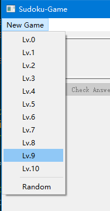
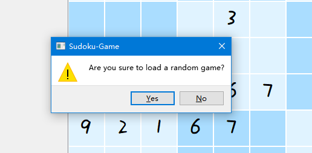
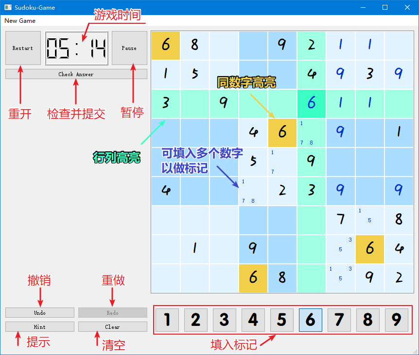
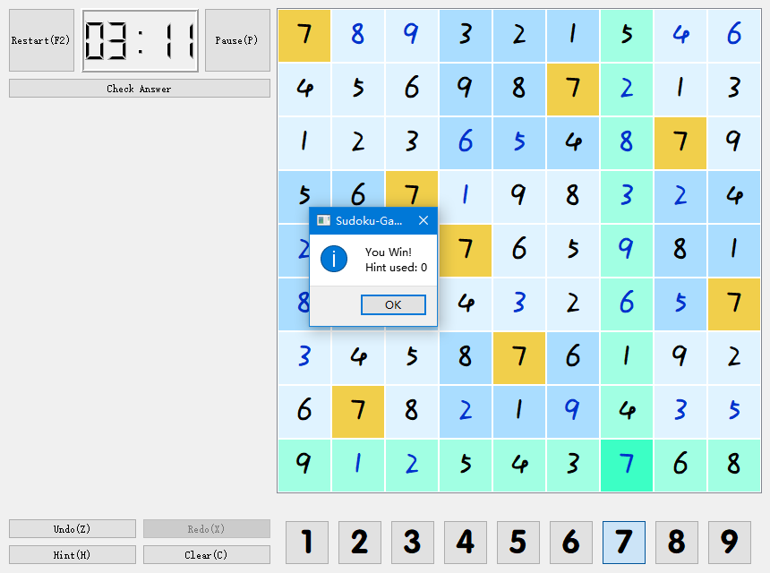

# [Sudoku-Game]
Project-Week1 in Summer 2017

*所用音效、音乐、图片素材均来源于网络，版权归原作者所有，侵删。*

## 预览

### Menu



### Start a random game



### Interface



### Winner, winner, chicken dinner!



## 基本功能实现

 - 9x9布局 可响应鼠标点击
 - 点击选中方格可对选中方格填数，通过选中数字按钮进行填数。[可用键盘填数]()
 - 重玩、暂停，暂停时计时停止，方格不可选中。 [暂停时显示暂停画面遮挡题目]()
 - 关卡选择 11个预制关卡 [还可随机生成题目]()
 - 撤销、恢复功能 [支持步数无限制]()
 - 清除功能
 - 相同数字高亮
 - 支持填入多个数字做标记
 - 点击Check Answer按钮可检查答案、并判断游戏结束。

## 特色功能拓展

 - 数独题目生成器
 - 为功能按钮设置了**Shortcut**供使用
 - 可通过键盘**数字键**填数、可通过**方向键**在网格内导航
 - 显示**暂停画面**遮挡题目
 - **SE & BGM**（音效与背景音乐）
 - 撤销删除操作支持步数**无限制！**
 - **求助按钮** 可提示选中的格子应填入的数字（填错的数字可通过Check Answer按钮检查）


## 实现时用到的黑科技

 - λ表达式：连接多组信号槽，方便地解决信号槽参数个数不匹配的问题。
 ```
 connect(numberButtonGroup->button(i),
        static_cast<void (QAbstractButton:: *)(bool checked)>(&QAbstractButton::clicked),
        this, [=](bool checked) { on_numberButton_clicked(i, checked); });
 ```

 - QSS：设置背景颜色、高亮颜色等。
 - 新开线程使BGM播放平稳(效果不佳)


## 主要类介绍

### GameWindow

游戏的主窗口。负责加载题目、选择关卡。

### SudokuTable

重写了 void [keyPressEvent]()(QKeyEvent* e) 将按键事件传递给GameArea处理。
通过在sudokuModel中添加SudokuBox实现游戏的基本界面。

### BgmThread

播放bgm的线程。

### SudokuCommand

重写了[undo]()()和[redo]()()，配合QUndoStack实现撤销与重做的功能。

### GameArea

游戏区域。负责SudokuTable、多个控制用Button、以及显示游戏时间。是本项目的核心。

#### 主要函数

| Function Name | Detail |
| :---- | :---- |
| bool [makeMarkOn]()(SudokuBox* box, int number, bool marked); | 在box上对number设置/清除标记。 |
| bool [setMarkOn]()(SudokuBox* box, markFlag f); | 将box的标记改为f。 |
| bool [clearMark]()(SudokuBox* box); | 清除box中的标记。 |
| void [freshNumberButtons]()(SudokuBox* box); | 将numberButtonGroup的状态与box同步。 |
| void [freshUndoRedoButtons]()(); | 将undoButton与redoButton的状态与当前同步。 |
| void [freshClearButton]()(SudokuBox *box); | 将clearButton的状态与box同步。 |
| void [freshStyle]()(QModelIndex current, int curN, QModelIndex previous, int preN); | 根据previous和current刷新字体、背景颜色等。 |
| void [setGameAreaActive]()(bool active); | 将游戏区域激活/休眠。 |


#### Buttons

| Button(Group) Name | Button Function | Shortcut
| :---- | :---- | ----: |
| numberButtonGroup | 填入/清除相应数字 | 1 ~ 9 |
| clearButton | 清除当前格子内所有标记 (若可编辑) | 0 and C |
| undoButton | 撤销 (可撤销步数无限制) | Z |
| redoButton | 恢复 (可重做步数无限制)| X |
| hintButton | 可给出选定格子的正确答案 | H |
| pauseButton | 暂停 (会遮挡题目) | P |
| restartButton | 重新开始游戏 | F2 |
| commitButton | 检查是否完成、是否正确解决了题目 | (No Shortcut) |

#### 关于游戏时间记录 与 暂停功能

暂停时会将游戏区域禁用、暂停计时，并遮挡游戏画面。

| 控件 | Function |
| :---- | :---- |
| timeLCD | 显示时间。 |
| QDateTime* gameTime | 记录时间。 |
| QTimer *timer | 每秒触发timeout()，更新时间。 |
| QImage *pauseImg | 暂停时遮挡游戏画面。 |

### markFlag

一个封装好的struct。通过位运算记录某格的标记状态。

### SudokuBox

负责管理格子的标记状态。通过信号槽机制将显示与数据同步。

#### Properties
| Property Name | Detail |
| :---- | :---- |
| int number | 填入的数字（0表示空） |
| markFlag mark | 该格的标记状态 |
| bool editable | 该格是否可编辑 |

#### Public Functions
| Function Name | Detail |
| :---- | :---- |
| int [getNumber]()() const; | return number. |
| markFlag [getMarks]()() const; | return mark. |
| bool [isEditable]()() const; | return editable. |
| int [countMarks]()() const; | return 标记的个数. |
| bool [setMark]()(int n, bool marked); | 将数字n标记为marked。 |
| bool [setMarkFlag]()(markFlag f); | 将mark设置为f |
| bool [clearMarks]()(); | 清空mark |

#### Signals
| Signal Name | Detail |
| :---- | :---- |
| void [numberChanged]()(); | emit when number changed. |
| void [markChanged]()(); | emit when mark changed. |

#### Private Slots
| Slot Name | Detail |
| :---- | :---- |
| void [on_numberChanged]()(); | 更新mLabel的状态 |
| void [on_numberChanged]()(); | 更新sLabels的状态 |

### SudokuGenerator

- 数独题目生成器。
- 将一个合法的种子数独随机进行以下若干次变换以生成新数独：
    - 交换floor
    - 交换tower
    - 同floor内交换row
    - 同tower内交换column
    - 转置
- 容易证明经上述变换的仍然合法。
- 在新数独中随机挖空生成题目。

## 心路历程 & Acknowledgement

- 关于主界面设计。一开始设计界面时本想用81个QPushButton实现数独的主界面，和dalao交流后发现自己太naive了。然后滚去查QTableView和QTableWidget的文档，花费了很长时间搞清楚Qt的Model/View/Delegate的模式。却发现和自己想要实现的功能（同一格内填多个数字、高亮选中的行、列、相同的数字）差距比较大。使用该模式也不便于自定义显示的风格。于是自己手撸了一个SudokuBox : public QWidget强行往TableView里面塞。虽然不太优雅，但总算实现了功能。
- 关于高亮。使用了QSS实现。但由于往QTableView中添加Item时，Item自身的背景颜色会被QTableView的设置覆盖（折腾了很久才发现直接对我写的QWidget设置背景颜色一点作用也没有），所剩的开发时间也不多，于是乎在SudokuBox的最底层放了一个QLabel bg用于设置背景颜色（这很暴力）。不过还是有一点瑕疵：点击格子时会卡顿一下下...虽然不是很长...现在回头来看应该有更好的实现方法。
- 关于数独生成器。参考了8.29课上同学介绍的论文中的方法。在此表示感谢。
- 关于SE & BGM。游戏的卡顿会影响到BGM，虽然新开了一个线程播放，但好像效果并不是很好。SE使用了[freesound](http://freesound.org/)上的免费资源。BGM使用了LaTale的*Wind from the Far East*

 *~~我为什么要写这个玩意~~*


 [Sudoku-Game]: <https://github.com/Ice-Cirno/Sudoku-Game>
